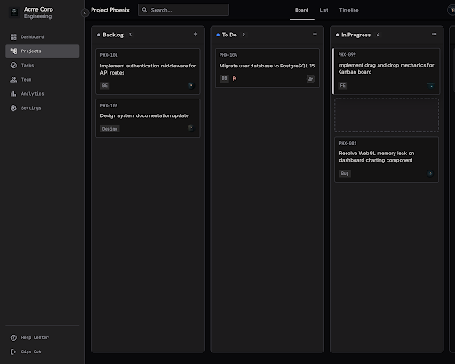

# PapanFokus



PapanFokus adalah aplikasi manajemen proyek kolaboratif berbasis Kanban (*mini-Jira/Trello*). Dirancang dengan fokus pada kecepatan, isolasi penyewa (*tenant isolation*), dan pembaruan antarmuka *real-time* untuk tim modern.

## 🚀 Fitur Utama
- **Real-Time Kanban Board:** Pemindahan tugas (*drag-and-drop*) yang sinkron antar pengguna secara instan tanpa jeda.
- **Tenant Isolation yang Ketat:** Setiap *workspace* dilindungi dengan lapis keamanan berlapis dari level Database (RLS) hingga Data Access Layer (DAL).
- **Role-Based Access Control (RBAC):** Peran granular untuk Admin, Member, dan Viewer dengan verifikasi operasional mandiri.
- **Fractional Positioning:** Algoritma pengurutan posisi matematis mencegah pergeseran/tabrakan urutan (*collision*) saat tugas dipindahkan.

## 🛠️ Tech Stack
- **Framework:** Next.js 16 (App Router)
- **Database:** PostgreSQL (Supabase)
- **ORM:** Drizzle ORM
- **Authentication:** Better Auth
- **Real-Time Engine:** Supabase Realtime (WebSockets via Broadcast)
- **Styling:** Tailwind CSS + shadcn/ui
- **State Management:** TanStack Query + Zustand
- **Drag & Drop:** `@dnd-kit/core`

## 📂 Struktur Folder Singkat
```text
PapanFokus/
├── docs/             # Dokumentasi teknis & arsitektur
├── e2e/              # Pengujian End-to-End dengan Playwright
├── src/
│   ├── actions/      # Next.js Server Actions
│   ├── app/          # Next.js App Router & Pages
│   ├── components/   # React Components (UI, Layout, Domain)
│   ├── dal/          # Data Access Layer & Security Guards
│   ├── db/           # Drizzle Schema & Konfigurasi Database
│   ├── hooks/        # Custom React Hooks
│   ├── lib/          # Helper Utilities & Zod Schemas
│   └── styles/       # Global CSS Styles
└── supabase/         # Migrasi Drizzle
```

## ⚙️ Cara Instalasi

1. **Kloning Repositori**
   ```bash
   git clone <repo-url>
   cd PapanFokus
   ```

2. **Instalasi Dependencies**
   ```bash
   npm install
   ```

3. **Konfigurasi Environment**
   Buat salinan file konfigurasi rahasia:
   ```bash
   cp .env.example .env.local
   ```
   *Isi variabel di `.env.local` dengan kredensial Supabase dan kunci Better Auth Anda.*

## 🚀 Cara Menjalankan Project

1. **Jalankan Migrasi Database** (Opsional jika baru pertama kali)
   ```bash
   npx drizzle-kit migrate
   ```

2. **Mulai Server Development**
   ```bash
   npm run dev
   ```
   Aplikasi dapat diakses di `http://localhost:3000`.

## 📦 Cara Build untuk Produksi

1. **Validasi Tipe dan Linter** (Opsional tapi disarankan)
   ```bash
   npm run lint
   npx tsc --noEmit
   ```

2. **Proses Build Next.js**
   ```bash
   npm run build
   ```

3. **Menjalankan Hasil Build**
   ```bash
   npm start
   ```

---
*Dikembangkan secara profesional untuk skalabilitas, keamanan, dan kolaborasi tanpa hambatan.*
