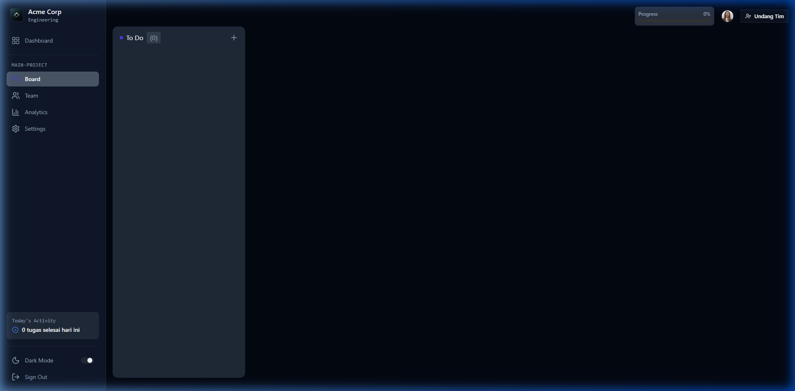
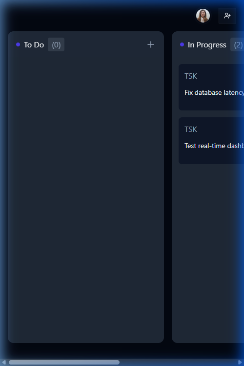

# 📌 PapanFokus

<div align="center">
  <p align="center">
    <strong>Aplikasi Manajemen Proyek Kanban Real-Time dengan Multi-Tenant Isolation yang Ketat</strong>
  </p>

  <p align="center">
    <a href="https://papan-fokus.vercel.app">
      
    </a>
  </p>

  <p align="center">
    
    
    
    
    
    
  </p>
</div>

---

## 📖 Tentang PapanFokus

**PapanFokus** adalah aplikasi manajemen proyek kolaboratif berbasis Kanban (*mini-Jira/Trello*) yang dirancang untuk tim modern yang mengutamakan **kecepatan**, **keamanan tingkat tinggi**, dan **sinkronisasi real-time**. 

Berbeda dengan aplikasi Kanban sederhana, PapanFokus dibangun dengan arsitektur **Multi-Tenant Isolation** di level basis data menggunakan PostgreSQL Row-Level Security (RLS) dan validasi ketat pada Data Access Layer (DAL). Dilengkapi dengan algoritma **Fractional Positioning** untuk pengurutan kartu drag-and-drop tanpa tabrakan data, serta pembaruan kolaborasi real-time tanpa jeda menggunakan WebSocket.

---

## 📸 Tampilan Aplikasi

### Desktop Workspace View


### Responsive Mobile View


---

## 🚀 Fitur Utama

- **⚡ Real-Time Kanban Board:** Pemindahan tugas (*drag-and-drop*) yang sinkron antar pengguna secara instan menggunakan Supabase Realtime Broadcast.
- **🔒 Multi-Tenant Isolation:** Setiap *workspace* diisolasi secara ketat. Pengguna hanya dapat mengakses data workspace tempat mereka terdaftar melalui validasi berlapis (Database RLS + Server Guard).
- **🛡️ Role-Based Access Control (RBAC):** Peran granular untuk **Admin** (pemilik/pengelola), **Member** (kolaborator aktif), dan **Viewer** (hanya lihat) untuk memastikan keamanan operasional.
- **🧮 Fractional Positioning Algorithm:** Pengurutan posisi kartu menggunakan nilai desimal dinamis untuk mencegah collision/pergeseran posisi saat beberapa pengguna memindahkan kartu secara bersamaan.
- **📱 Responsive & Modern UI:** Antarmuka gelap (*dark mode*) yang premium menggunakan Tailwind CSS, Shadcn/ui, dan transisi mikro-animasi yang halus.
- **🧪 E2E Tested:** Dilengkapi dengan pengujian otomatis *end-to-end* menggunakan Playwright untuk menjaga stabilitas alur kerja Kanban.

---

## 🛠️ Tech Stack & Architecture

- **Framework:** Next.js 15 (App Router, Server Actions, API Routes)
- **Database:** PostgreSQL (Supabase) dengan Drizzle ORM
- **Authentication:** Better Auth (dengan email & password login aman)
- **Real-Time Engine:** Supabase Realtime WebSockets
- **Drag & Drop:** `@dnd-kit/core` & `@dnd-kit/sortable`
- **State Management:** TanStack Query + Zustand
- **E2E Testing:** Playwright

---

## ⚙️ Panduan Instalasi Lokal

### Prasyarat
- Node.js LTS (v18+)
- Database PostgreSQL (atau akun Supabase)

### Langkah-langkah

1. **Kloning Repositori**
   ```bash
   git clone https://github.com/twiners212/papan-fokus.git
   cd PapanFokus
   ```

2. **Instalasi Dependencies**
   ```bash
   npm install
   ```

3. **Konfigurasi Environment**
   Salin file template environment variable:
   ```bash
   cp .env.example .env.local
   ```
   Buka file `.env.local` dan isi nilai yang sesuai:
   ```env
   # PostgreSQL database connection (Pooler & Direct)
   DATABASE_URL="postgresql://..."
   DIRECT_URL="postgresql://..."

   # Better Auth Config
   BETTER_AUTH_SECRET="your-better-auth-secret-key"
   BETTER_AUTH_URL="http://localhost:3000"

   # Supabase Credentials for Realtime Broadcast
   NEXT_PUBLIC_SUPABASE_URL="https://your-supabase-project.supabase.co"
   NEXT_PUBLIC_SUPABASE_ANON_KEY="your-anon-key"
   ```

4. **Jalankan Migrasi Database**
   ```bash
   npx drizzle-kit migrate
   ```

5. **Mulai Server Development**
   ```bash
   npm run dev
   ```
   Buka `http://localhost:3000` pada browser Anda.

---

## 📦 Build Produksi & Pengujian

- **Build Aplikasi:**
  ```bash
  npm run build
  ```
- **Jalankan Hasil Build:**
  ```bash
  npm run start
  ```
- **Jalankan End-to-End Test (Playwright):**
  ```bash
  npx playwright test
  ```

---

## 📄 Lisensi
Proyek ini dilisensikan di bawah [MIT License](LICENSE).

---
*Dikembangkan secara mandiri dengan standar keamanan dan skalabilitas enterprise.*
