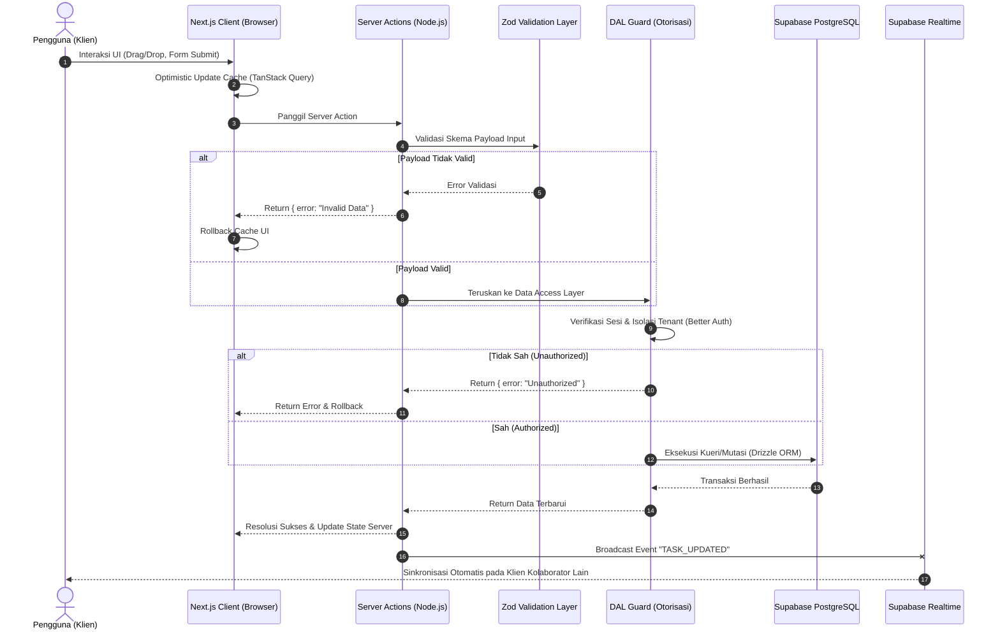

# ARCHITECTURE.md - Real-Time Collaborative Project Management (Mini-Jira/Trello)

## Deskripsi Proyek
Dokumen ini mendefinisikan standar arsitektur teknis dan keputusan rekayasa (Engineering Decisions) untuk aplikasi **Real-Time Collaborative Project Management (Mini-Jira/Trello)**. Arsitektur ini dirancang untuk menyeimbangkan kecepatan pengembangan pada fase MVP dengan ketangguhan skalabilitas jangka panjang, memastikan stabilitas pengalaman kolaborasi multi-pengguna secara *real-time*.

## Stack Teknologi Utama
* **Framework:** Next.js 14+ (App Router)
* **Language:** TypeScript
* **Database:** PostgreSQL (via Supabase)
* **ORM:** Drizzle ORM
* **Authentication:** Better Auth
* **State Management & Caching:** TanStack Query (React Query)
* **Real-time Engine:** Supabase Realtime
* **Drag-and-Drop:** `@dnd-kit`
* **Deployment:** Vercel (Frontend & Serverless), Supabase (Database)

---

## Keputusan Arsitektur Inti (Architectural Decisions)

### 1. Struktur Aplikasi dan Folder: Feature-Driven Architecture (Vertical Slicing)
Aplikasi diorganisasikan berdasarkan domain bisnis (misal: `auth`, `workspaces`, `tasks`, `realtime`), bukan lapisan teknis. Setiap folder fitur memuat *components*, *actions*, *queries*, *schema*, dan *type* secara mandiri. Kode *reusable* ditempatkan pada direktori `shared`. 
* **Tujuan:** Mencegah *spaghetti code*, memudahkan pengelolaan batas domain, dan menjaga skalabilitas kode.

### 2. Autentikasi: Hybrid Middleware & Data Access Layer (DAL)
Menggunakan manajemen sesi berbasis *httpOnly cookies* via Better Auth. Middleware Next.js di lingkungan *Edge* difungsikan sebagai lapis pertama untuk *redirect* cepat. Validasi otentikasi mendalam, pengecekan sesi, dan otorisasi kriptografi dieksekusi oleh DAL dan Server Components di lingkungan Node.js.
* **Tujuan:** Menjaga UI responsif sekaligus memastikan keamanan yang kompatibel secara mulus dengan Drizzle ORM.

### 3. Otorisasi & Akses Data: App-Level Authorization (Logic-Driven)
Tidak menggunakan Row Level Security (RLS) PostgreSQL untuk MVP. Seluruh otorisasi berbasis peran (Admin, Member, Viewer) dan kepemilikan *workspace* divalidasi langsung di dalam fungsi *Data Access Layer* menggunakan Drizzle ORM (TypeScript). RLS disiapkan sebagai utang teknis untuk lapisan pertahanan tambahan di masa depan.
* **Tujuan:** Mengurangi kompleksitas injeksi konteks *database*, memudahkan pengujian unit, dan mempercepat fase MVP.

### 4. Aliran Data (Data Flow): Hybrid Client-Cache (TanStack Query)
Server Components difungsikan khusus untuk mengambil data awal (*initial hydration*), SSR, dan SEO. Setelah klien dimuat, **TanStack Query** mengambil alih secara penuh manajemen *state* dan memori *cache*. Seluruh mutasi dieksekusi melalui Server Actions.
* **Tujuan:** Memberikan UX *real-time* dan *optimistic update* yang lebih mulus tanpa keterbatasan utilitas `revalidatePath` Next.js.

### 5. Arsitektur Real-Time: Application-Driven (Custom Channel Broadcasts)
Memanfaatkan `@supabase/supabase-js` dengan saluran per *workspace* (`workspace:{workspaceId}`). Penyiaran (*broadcasting*) dilakukan eksklusif oleh Server Actions **setelah** mutasi *database* berhasil. *Payload* menggunakan JSON kustom yang disanitasi, terikat pada 5 Event Inti (`TASK_CREATED`, `TASK_UPDATED`, `TASK_MOVED`, `TASK_ASSIGNED`, `TASK_DELETED`).
* **Tujuan:** Keamanan mutlak, *payload* yang ringan, dan stabilitas API frontend meski skema *database* berubah.

### 6. Optimistic Updates: Cache-Level Manipulation
Pembaruan UI instan untuk aksi *drag-and-drop* dan mutasi lainnya diandalkan 100% pada mekanisme `onMutate`, `setQueryData`, `onError`, dan `onSettled` milik TanStack Query. *Framework native* seperti React `useOptimistic` tidak digunakan.
* **Tujuan:** Menghindari *split-brain state* dan memastikan *source of truth* lokal hanya berada di satu tempat.

### 7. Strategi Caching: Fully Dynamic Server (Opt-out Next.js Cache)
Untuk halaman kolaboratif (`/[workspace_slug]/board`), sistem dipaksa sebagai *dynamic route* (`force-dynamic`). *Data Cache* dan *Full Route Cache* bawaan Next.js dinonaktifkan sepenuhnya di *board*, menyerahkan seluruh kendali *caching* kepada klien via TanStack Query setelah respons awal ditarik dari *database*.
* **Tujuan:** Mengeliminasi konflik sinkronisasi ganda (*dual-caching*) dan mencegah pengguna melihat data kedaluwarsa.

### 8. Akses Database: Repository / DAL Pattern
Pemisahan logika kueri secara ketat. Komponen UI, Server Components, dan utilitas *Real-Time* **dilarang** menulis kueri Drizzle ORM secara langsung. Semua interaksi *database* melewati fungsi *wrapper* yang terisolasi di dalam *Data Access Layer* (DAL) pada masing-masing domain fitur.
* **Tujuan:** Titik kontrol terpusat untuk keamanan kueri, kemudahan *refactoring*, dan *type-safety*.

### 9. Arsitektur Drag-and-Drop: Server-Side Calculation (DAL-Driven)
Klien hanya bertanggung jawab untuk interaksi visual dan *optimistic update* menggunakan `@dnd-kit`. Mekanisme Fractional Positioning wajib menggunakan tipe data **DOUBLE PRECISION** dengan sistem *rebalancing*. Seluruh kalkulasi matematika pemosisian diproses di sisi peladen (DAL) dengan menerima indeks kartu tetangga dari *frontend*.
* **Tujuan:** Mencegah tabrakan (*collision*) posisi, menghindari hilangnya presisi desimal matematika akibat penggunaan float, serta menjaga integritas urutan papan Kanban.

### 10. Strategi Error Handling: Result Pattern (Type-Safe Return Objects)
Server Actions pantang melakukan `throw Error` untuk kegagalan logika bisnis. Semua kegagalan validasi, otorisasi, dan konflik operasi mengembalikan kontrak terprediksi: `{ success: boolean, data?: T, error?: string }`. *Exceptions* hanya digunakan untuk sistem mogok (*crash*) atau galat *database* tak terduga.
* **Tujuan:** Mencegah UI meledak ke `error.tsx` dan membiarkan *frontend* menangani pemulihan *cache* (rollback) secara elegan.

### 11. Deployment: Serverless PaaS
Aplikasi klien dan peladen Next.js di- *deploy* di **Vercel** untuk CI/CD yang cepat dan beban DevOps minimum. PostgreSQL ditangani oleh **Supabase**. Koneksi *database* distabilkan menggunakan **Supavisor** (Connection Pooling) untuk menangkal masalah latensi *Cold Start* *serverless*.
* **Tujuan:** Eksekusi MVP yang cepat, biaya efisien, dan tanpa pusing memikirkan manajemen *server* (VM).

### 12. Peta Jalan Skalabilitas: Scale-Up & Partitioning (Supabase-Centric)
Tidak ada optimasi terdistribusi prematur (*premature optimization*). Jika sistem mulai kewalahan, penskalaan dilakukan secara vertikal pada *compute* Vercel/Supabase, digabungkan dengan optimasi PostgreSQL tingkat lanjut (*Indexing*, *Table Partitioning* pada tabel besar, *Archiving*). Pemecahan *microservices* hanya dilakukan jika batas platform absolut tercapai.
* **Tujuan:** Menjaga kompleksitas tim seminimal mungkin dan fokus pada pengembangan produk yang menghasilkan nilai bagi pengguna.

### 13. Server Communication: Server Actions First
Semua mutasi data wajib menggunakan Server Actions. Route Handler (`/api/*`) hanya digunakan untuk webhook pihak ketiga, integrasi eksternal, dan endpoint publik. Frontend dilarang melakukan *fetch* langsung ke *database* atau DAL.
* **Tujuan:** Mencegah pembuatan API secara sembarangan (*spaghetti API*), menjaga kerapian rute, dan memastikan *type-safety* *end-to-end*.

### 14. Validation Layer: Zod-First
Semua input dari *Form*, URL Params, Search Params, dan *Server Actions* harus divalidasi menggunakan **Zod** sebelum masuk ke DAL. Aliran data wajib melewati: `Client -> Zod -> Server Action -> DAL -> Database`.
* **Tujuan:** Mencegah manipulasi muatan (*payload manipulation*) dan menjamin data masuk sistem telah tervalidasi secara absolut.

### 15. Observability: Logging & Monitoring
Penggunaan `console.log` dilarang pada kode *production*. Tim diwajibkan menggunakan *structured logging*, dan seluruh *error* tak terduga harus dikirim ke layanan pemantauan seperti **Sentry**.
* **Tujuan:** Memberikan konteks (*stack trace*) yang jelas saat melacak *bug real-time* atau *race condition* di lingkungan *production*.

### 16. Concurrency Strategy: Last Write Wins (LWW)
Untuk MVP, konflik diselesaikan menggunakan mekanisme **Last Write Wins (LWW)**. Update terakhir yang berhasil melakukan *commit* transaksi ke database PostgreSQL menjadi sumber kebenaran tunggal. Field `updated_at` digunakan murni sebagai metadata audit, bukan sebagai mekanisme utama resolusi konflik.
* **Tujuan:** Menyelesaikan konflik perubahan data simultan secara deterministik berdasarkan urutan kunci transaksi database, terbebas dari isu *clock drift* atau ketidakakuratan resolusi milidetik pada *timestamp*.

### 17. Database Schema Management
Seluruh perubahan skema wajib menggunakan alat kelola migrasi Drizzle (`drizzle-kit generate` dan `drizzle-kit migrate`). Perubahan skema manual secara langsung pada *production database* sangat dilarang.
* **Tujuan:** Menghindari masalah *schema drift* antara lingkungan lokal dan produksi, serta memastikan riwayat evolusi database tersimpan di *version control*.

### 18. Database Transactions
Operasi yang memodifikasi atau membuat lebih dari satu entitas di dalam satu rangkaian proses bisnis wajib dibungkus di dalam *Drizzle Transaction* (`db.transaction()`). Penyiaran data *real-time* (broadcast) hanya boleh dipicu **setelah** transaksi berhasil dinyatakan sukses (*commit*).
* **Tujuan:** Menjamin atomisitas data (prinsip *All-or-Nothing*) dan mencegah penyiaran perubahan data palsu (*phantom broadcast*) akibat kegagalan operasi di tengah jalan.

### 19. Background Processing
Tugas komputasi non-kritis (seperti pengiriman email undangan, analitik log, notifikasi *digest*, pembersihan arsip berkala) tidak boleh dijalankan secara sinkron yang dapat menghambat siklus hidup respons utama pengguna.
* **Tujuan:** Meminimalkan *latency* yang dirasakan pengguna dengan menghindari pekerjaan non-esensial di dalam *request lifecycle*. Solusi MVP dapat diorkestrasi menggunakan *Vercel Cron* atau eksekusi pemicu asinkron (*async*) ringan.

### 20. Configuration Management: Type-Safe Environment Variables
Seluruh *environment variable* (terutama parameter vital seperti `DATABASE_URL`, kunci otentikasi, dan kredensial Supabase) wajib divalidasi saat aplikasi pertama kali melakukan *startup* menggunakan **Zod**. Aplikasi dikonfigurasi untuk langsung mogok/gagal *booting* (Fail-Fast) jika konfigurasi wajib tidak tersedia atau tidak valid.
* **Tujuan:** Mengeliminasi kegagalan senyap (*silent failures*) di lingkungan produksi yang disebabkan oleh kesalahan konfigurasi parameter lingkungan.

---

## Diagram Alir Data (Data Flow Diagram)

Berikut adalah diagram alir interaksi data end-to-end yang mengilustrasikan bagaimana sebuah mutasi (misalnya pembuatan kartu tugas) diproses mulai dari sisi klien hingga ke database, melalui **DAL Guard** untuk isolasi *tenant* dan keamanan.

